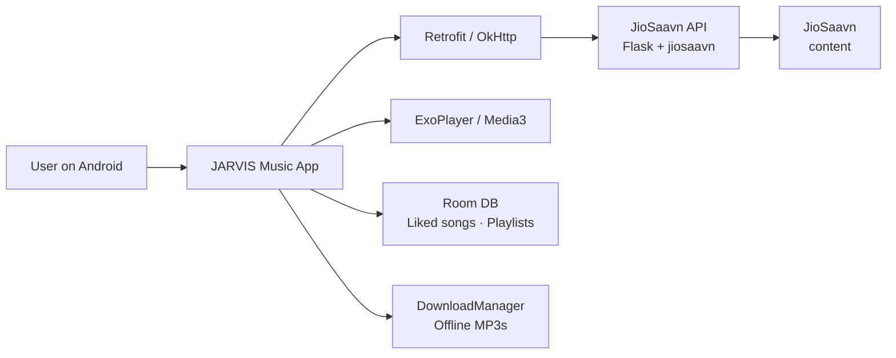

<div align="center">

# JARVIS Music

**A native Android music player for JioSaavn content — part of the JARVIS ecosystem.**

[](#)
[](#)
[](#)
[](#)
[](#)
[](#)
[](https://github.com/CodeWithLakxsh/jarvis-music/releases/latest)

*Built by [CodeWithLakxsh](https://github.com/CodeWithLakxsh)*

</div>

---

## 📦 Download

Get the latest signed APK from the [Releases page](https://github.com/CodeWithLakxsh/jarvis-music/releases/latest):

[](https://github.com/CodeWithLakxsh/jarvis-music/releases/latest)

Prefer to build it yourself? Skip ahead to [Installation](#installation) → **Build from source**.

## Overview

JARVIS Music is an **Android-first music streaming app** that brings a Spotify-style experience to JioSaavn content. It searches and streams songs through a self-hostable **JioSaavn API** (a Flask + `jiosaavn` backend included in this repository), with support for offline downloads, liked-song libraries, and custom playlists.

The app is a flagship piece of the **JARVIS ecosystem** — a family of projects by CodeWithLakxsh.

> Note: this README is derived entirely from static source analysis. The project has not been runtime-tested for this publication.

## Features

All features below are verified directly from the source code:

- **Search & stream** — search JioSaavn songs via the bundled API (`Retrofit` + `Result` endpoint), stream with **Media3 / ExoPlayer**.
- **Home dashboard** — trending/mix sections (Hindi, Punjabi, Hip-Hop, Pop, etc.) rendered as a grid and horizontal rows.
- **Mini + full player** — bottom-sheet player with album art, seek bar, and controls (play/pause, next/prev).
- **Infinite queue** — when the queue runs low, new songs are auto-fetched and appended; shuffle & repeat modes included.
- **Liked songs** — heart any track; saved locally in **Room**.
- **Offline downloads** — download songs via Android `DownloadManager` to the app's external music folder; play them back offline.
- **Playlists** — create playlists, add songs, and play them back.
- **Search history** — recent queries saved with `SharedPreferences`.
- **Onboarding** — pick favourite artists on first launch.
- **Artist profiles** — open an artist's top tracks from search results.
- **Dark theme** — always-on dark UI with a Spotify-green accent (`#1DB954`).

## Tech Stack

| Layer | Technology |
|---|---|
| Language | [Kotlin](https://kotlinlang.org/) |
| UI | Android Jetpack (AppCompat, Material Components, ViewBinding, ConstraintLayout) |
| Media | [Media3 / ExoPlayer](https://developer.android.com/media/media3) |
| Networking | [Retrofit 2](https://square.github.io/retrofit/) + Gson, [OkHttp](https://square.github.io/okhttp/) |
| Image loading | [Glide](https://github.com/bumptech/glide) |
| Local storage | [Room](https://developer.android.com/training/data-storage/room) |
| Concurrency | Kotlin Coroutines |
| Build | Gradle (Kotlin DSL) 8.13 · AGP 8.11.2 · Kotlin 2.0.21 |
| Backend API | Python [Flask](https://flask.palletsprojects.com/) + `jiosaavn` library |

## How It Works

The Android app never talks to JioSaavn directly. It calls a **JioSaavn API** service that wraps the `jiosaavn` Python package and returns a normalized JSON list of songs. The app's `RetrofitInstance` points at a deployed instance of that API (configurable in `app/src/main/java/com/laksh/jarvismusic/api/RetrofitInstance.kt`).



## Project Structure

```
JarvisMusic/
├── app/                          # Android application module
│   └── src/main/
│       ├── java/com/laksh/jarvismusic/
│       │   ├── MainActivity.kt   # Player host, queue, mini/full player
│       │   ├── HomeFragment.kt   # Dashboard sections
│       │   ├── SearchFragment.kt # Search + history
│       │   ├── LibraryFragment.kt# Liked / Downloads / Playlists
│       │   ├── OnboardingActivity.kt
│       │   ├── ArtistProfileActivity.kt
│       │   ├── PlaylistsActivity.kt / PlaylistDetailsActivity.kt
│       │   ├── LikedSongsActivity.kt / DownloadedSongsActivity.kt
│       │   ├── api/              # Retrofit, Room entities & DAOs
│       │   └── *Adapter.kt       # RecyclerView adapters
│       └── res/                  # Layouts, drawables, themes, menus
├── api/                          # Self-hostable JioSaavn API (Python/Flask)
│   ├── index.py                  # Flask entry point (port 5100)
│   └── requirements.txt
├── gradle/                       # Gradle wrapper & version catalog
├── build.gradle.kts
├── settings.gradle.kts
└── gradle.properties
```

## Requirements

> Inferred from build configuration and dependency manifests — not runtime-verified.

- **Android Studio** (Iguana or newer) with the Android SDK platform **35**.
- **JDK 17** (required by the Gradle configuration).
- **Gradle 8.13** — the wrapper is included (`gradlew`).
- For the backend API: **Python 3.8+** and `pip`.

## Installation

You can either **download a pre-built APK** or **build from source**.

### Download APK

1. Download the latest APK from the [Releases page](https://github.com/CodeWithLakxsh/jarvis-music/releases/latest).
2. Open the APK on your Android device (Android 7.0 / API 24+).
3. If prompted, allow **"Install unknown apps"** for your browser or file manager, then tap **Install**.

### Build from source

> Commands below are derived from the project's configuration and source.

```bash
# Clone the repository
git clone https://github.com/CodeWithLakxsh/jarvis-music.git

# Build a debug APK
./gradlew assembleDebug
```

Alternatively, open the project in **Android Studio**, let Gradle sync, and press **Run**.

### Backend API

```bash
cd api
pip install -r requirements.txt
python index.py        # serves on 0.0.0.0:5100
```

The Android app expects an API instance at the `BASE_URL` defined in `RetrofitInstance.kt`. Point it at a local or deployed instance of `api/`.

## Configuration

| Variable | Where | Purpose |
|---|---|---|
| `SECRET` | `api/` environment | Flask session-signing key. If unset, a random key is generated per process. |
| `BASE_URL` | `RetrofitInstance.kt` | Base URL of the JioSaavn API the app queries. |

See [`api/.env.example`](api/.env.example) for the backend environment template.

## Usage

- On first launch, choose at least **3 artists** to personalise your library.
- Use **Home** to browse sections, **Search** to find any song, and **Library** to access liked songs, downloads, and playlists.
- Tap a song to start playback; swipe the player sheet up for the full player with queue, shuffle, and repeat.
- Tap the heart to like a song, the download icon to save it offline.

## Build

The release build type is configured in `app/build.gradle.kts` (minification disabled, ProGuard rules at `app/proguard-rules.pro`). Build an APK with:

```bash
./gradlew assembleRelease
```

## Security

- The Flask backend reads its signing key from the `SECRET` environment variable — **never** commit a real `.env` file (see [`.gitignore`](.gitignore)).
- Reports for security issues: see [SECURITY.md](SECURITY.md).

## Contributing

Contributions are welcome! Please read [CONTRIBUTING.md](CONTRIBUTING.md) and the issue templates before opening a pull request.

## License

No open-source license has currently been granted for this repository.

## Author

**CodeWithLakxsh**

- GitHub: [https://github.com/CodeWithLakxsh](https://github.com/CodeWithLakxsh)
- Portfolio: [https://codewithlakxsh.github.io/](https://codewithlakxsh.github.io/)
