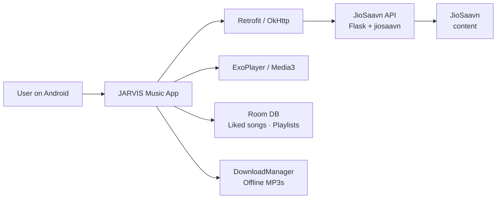

<div align="center">

# JARVIS Music

**A native Android music player for JioSaavn content — part of the JARVIS ecosystem.**

[](#)
[](#)
[](#)
[](#)
[](#)
[](#)
[](https://github.com/CodeWithLakxsh/jarvis-music/releases/latest)

*Built by [CodeWithLakxsh](https://github.com/CodeWithLakxsh)*

</div>

---

## 📦 Download

Get the latest signed APK from the [Releases page](https://github.com/CodeWithLakxsh/jarvis-music/releases/latest):

[](https://github.com/CodeWithLakxsh/jarvis-music/releases/latest)

Prefer to build it yourself? Skip ahead to [Installation](#installation) → **Build from source**.

## Overview

JARVIS Music is an **Android-first music streaming app** that brings a Spotify-style experience to JioSaavn content. It searches and streams songs through a self-hostable **JioSaavn API** (a Flask + `jiosaavn` backend included in this repository), with support for offline downloads, liked-song libraries, and custom playlists.

The app is a flagship piece of the **JARVIS ecosystem** — a family of projects by CodeWithLakxsh.

> Note: this README is derived entirely from static source analysis. The project has not been runtime-tested for this publication.

## Features

All features below are verified directly from the source code:

- **Spotify-style UI** — dark theme, gradient Home header, filter chips, 2-column "recently played" grid, carousels, round artist bubbles, colourful "Browse all" genre tiles and playlist-style pages with a big cover and green play button.
- **Search & stream** — search-as-you-type against the bundled JioSaavn API, a "Top result" card, and recent searches you can remove one by one or clear.
- **Home dashboard** — greeting, "Jump back in", "Your top mixes" (built from the artists you picked), trending/romantic/party/chill rows and language filters (Hindi, Punjabi, English, Haryanvi). Pull to refresh.
- **Mini + full player** — floating mini player tinted with the album colour (with like button and progress line), full-screen player with album-colour gradient, seek bar with elapsed/remaining time, shuffle, repeat (off / all / one), like, download, share and queue.
- **Change songs your way** — swipe the mini player or the album art left/right to skip, tap "previous" to restart the song (or go back within 3 seconds).
- **Queue** — see what's playing and what's next, tap a song to jump to it, drag to reorder, swipe to remove. "Play next" and "Add to queue" from any song.
- **Song menu (⋮)** on every song — like, add to playlist, remove from playlist, play next, add to queue, download / remove download, go to artist, share.
- **Background playback** — playback runs in a Media3 `MediaSessionService` with a media notification, lock-screen, Bluetooth and headset controls; pauses when headphones are unplugged.
- **Autoplay** — when the queue runs out, similar songs are added automatically.
- **Liked songs, playlists, downloads** — liked songs (newest first) and playlists stored in **Room**; create, rename and delete playlists; offline downloads via `DownloadManager` that keep title/artist/artwork and play from the local file.
- **Onboarding** — pick favourite artists on first launch; they power your Home mixes and Library.

## Tech Stack

| Layer | Technology |
|---|---|
| Language | [Kotlin](https://kotlinlang.org/) |
| UI | Android Jetpack (AppCompat, Material Components, ViewBinding, ConstraintLayout) |
| Media | [Media3 / ExoPlayer + MediaSession](https://developer.android.com/media/media3) |
| Networking | [Retrofit 2](https://square.github.io/retrofit/) + Gson, [OkHttp](https://square.github.io/okhttp/) |
| Image loading | [Glide](https://github.com/bumptech/glide) |
| Local storage | [Room](https://developer.android.com/training/data-storage/room) |
| Concurrency | Kotlin Coroutines |
| Build | Gradle (Kotlin DSL) 8.13 · AGP 8.11.2 · Kotlin 2.0.21 |
| Backend API | Python [Flask](https://flask.palletsprojects.com/) + `jiosaavn` library |

## How It Works

The Android app never talks to JioSaavn directly. It calls a **JioSaavn API** service that wraps the `jiosaavn` Python package and returns a normalized JSON list of songs. The app's `RetrofitInstance` points at a deployed instance of that API (configurable in `app/src/main/java/com/laksh/jarvismusic/api/RetrofitInstance.kt`).


```mermaid
flowchart LR
    U[User on Android] --> A[JARVIS Music App]
    A --> B[Retrofit / OkHttp]
    B --> C[JioSaavn API<br/>Flask + jiosaavn]
    C --> D[JioSaavn<br/>content]
    A --> E[ExoPlayer / Media3]
    A --> F[Room DB<br/>Liked songs · Playlists]
    A --> G[DownloadManager<br/>Offline MP3s]
```

## Project Structure

```
JarvisMusic/
├── app/                          # Android application module
│   └── src/main/
│       ├── java/com/laksh/jarvismusic/
│       │   ├── MainActivity.kt       # Tabs, mini/full player, queue & song menus
│       │   ├── PlaybackService.kt    # Media3 session service (background playback)
│       │   ├── HomeFragment.kt       # Home: greeting, grid, mixes, carousels
│       │   ├── SearchFragment.kt     # Browse all, recent searches, results
│       │   ├── LibraryFragment.kt    # Your Library (liked, downloads, playlists, artists)
│       │   ├── CollectionFragment.kt # Playlist-style page (liked, downloads, playlists, artists, genres)
│       │   ├── OnboardingActivity.kt
│       │   ├── DownloadStore.kt      # Offline downloads + metadata
│       │   ├── LocalStore.kt         # Recents, search history, shared player state
│       │   ├── SongUtils.kt / UiUtils.kt
│       │   ├── api/                  # Retrofit, Room entities & DAOs
│       │   └── *Adapter*.kt          # RecyclerView adapters
│       └── res/                  # Layouts, drawables, themes, menus
├── api/                          # Self-hostable JioSaavn API (Python/Flask)
│   ├── index.py                  # Flask entry point (port 5100)
│   └── requirements.txt
├── gradle/                       # Gradle wrapper & version catalog
├── build.gradle.kts
├── settings.gradle.kts
└── gradle.properties
```

## Requirements

> Inferred from build configuration and dependency manifests — not runtime-verified.

- **Android Studio** (Iguana or newer) with the Android SDK platform **35**.
- **JDK 17** (required by the Gradle configuration).
- **Gradle 8.13** — the wrapper is included (`gradlew`).
- For the backend API: **Python 3.8+** and `pip`.

## Installation

You can either **download a pre-built APK** or **build from source**.

### Download APK

1. Download the latest APK from the [Releases page](https://github.com/CodeWithLakxsh/jarvis-music/releases/latest).
2. Open the APK on your Android device (Android 7.0 / API 24+).
3. If prompted, allow **"Install unknown apps"** for your browser or file manager, then tap **Install**.

### Build from source

> Commands below are derived from the project's configuration and source.

```bash
# Clone the repository
git clone https://github.com/CodeWithLakxsh/jarvis-music.git

# Build a debug APK
./gradlew assembleDebug
```

Alternatively, open the project in **Android Studio**, let Gradle sync, and press **Run**.

### Backend API

```bash
cd api
pip install -r requirements.txt
python index.py        # serves on 0.0.0.0:5100
```

The Android app expects an API instance at the `BASE_URL` defined in `RetrofitInstance.kt`. Point it at a local or deployed instance of `api/`.

## Configuration

| Variable | Where | Purpose |
|---|---|---|
| `SECRET` | `api/` environment | Flask session-signing key. If unset, a random key is generated per process. |
| `BASE_URL` | `RetrofitInstance.kt` | Base URL of the JioSaavn API the app queries. |

See [`api/.env.example`](api/.env.example) for the backend environment template.

## Usage

- On first launch, choose at least **3 artists** to personalise your library.
- Use **Home** to browse sections, **Search** to find any song or browse genres, and **Your Library** to open liked songs, downloads, playlists and artists.
- Tap a song to start playback. Swipe the mini player (or the album art in the full player) left/right to change songs; tap it or swipe up for the full player.
- Tap **⋮** on any song for play next, add to queue, add to playlist, download, go to artist and share. Open the queue from the full player to jump to, reorder or remove songs.
- Tap the heart to like a song, the download icon to save it offline. Long-press a playlist in Your Library (or use **⋯** on its page) to rename or delete it.
- Music keeps playing in the background — control it from the notification or lock screen.

## Build

The release build type is configured in `app/build.gradle.kts` (minification disabled, ProGuard rules at `app/proguard-rules.pro`). Build an APK with:

```bash
./gradlew assembleRelease
```

## Security

- The Flask backend reads its signing key from the `SECRET` environment variable — **never** commit a real `.env` file (see [`.gitignore`](.gitignore)).
- Reports for security issues: see [SECURITY.md](SECURITY.md).

## Contributing

Contributions are welcome! Please read [CONTRIBUTING.md](CONTRIBUTING.md) and the issue templates before opening a pull request.

## License

No open-source license has currently been granted for this repository.

## Author

**CodeWithLakxsh**

- GitHub: [https://github.com/CodeWithLakxsh](https://github.com/CodeWithLakxsh)
- Portfolio: [https://codewithlakxsh.github.io/](https://codewithlakxsh.github.io/)
